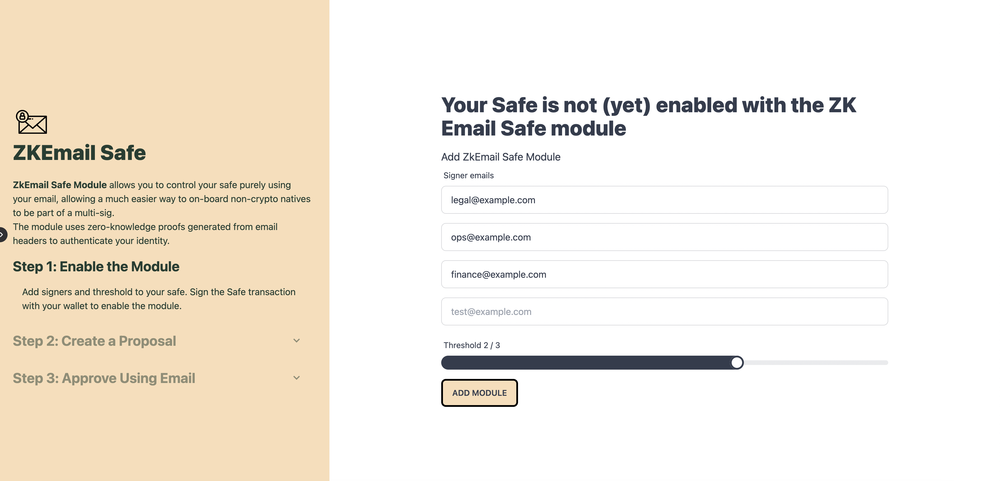

# ZkEmail Safe Module

## Overview

This Safe module allows signers to control a Safe multisig using purely their email by leveraging zero-knowledge proofs. They can use their email to securely interact with a safe either through an email relayer or generate the zkSNARK locally and posting the message on-chain. There are a few components in this repository.

```
- circuits
- contracts
- relayer
- zkemail-safe
```

### Circuits
Circom circuits that help with email header verification to prove that the email header is signed off by the right email server and the contents of the email are not tampered with. 

The circuits leverage the work by the [zkEmail team](https://github.com/zkemail) with special thanks to @yush_g for helping with troubleshooting,

### Contracts
Solidity contracts to implement the Safe Module and the generated output from the circom circuits.

### Relayer
Email relayer that listens to emails from a single email address using pop3. Takes the email, generate a zk proof and sends the transaction on chain. 

### ZkEmail Safe App
UI layer that implements the Safe SDK.



